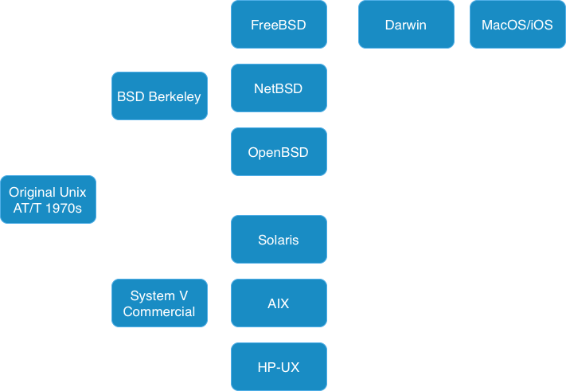
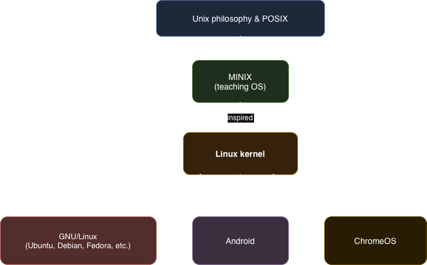

# What is Unix?

Unix is a family of operating systems that was first developed in 1969. The original version was called Multics. Unix became the foundation for many modern operating systems.

## Key Unix Characteristics:

- Multi-user and multi-tasking operating system
- Hierarchical file system
- Simple, powerful command-line interface
- "Everything is a file" philosophy

## Known Unix Versions:

- **AIX** - IBM's version of Unix
- **BSD** - Berkeley Software Distribution
- **HP-UX** - Hewlett-Packard's Unix
- **Solaris** - Oracle/Sun's Unix

## Important Facts:

- Linux has been the most widely used Unix-like system since around 2000
- macOS is based on FreeBSD, an open-source Unix variant

---

## Navigation

**Previous:** [← Introduction And Objectives](00-introduction-and-objectives.md)  
**Next:** [→ Operating System Vs Kernel](02-operating-system-vs-kernel.md)  
**Lesson Home:** [↑ Lesson 1: Introduction to Linux and Unix](../)  
**Course Home:** [⌂ Introduction to Linux](../README.md)
