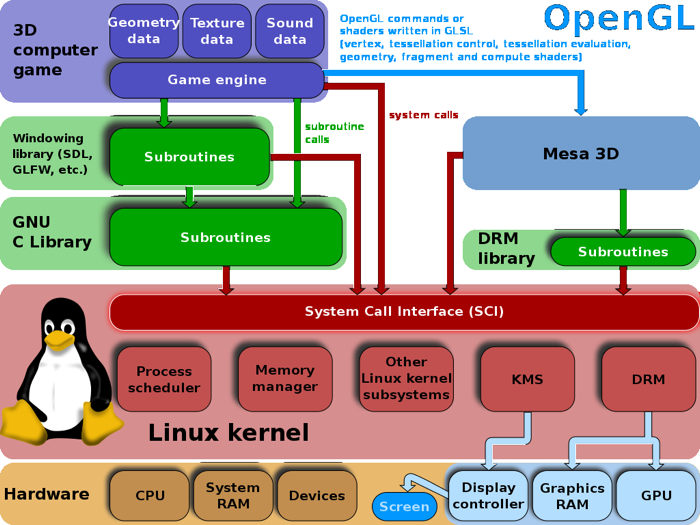

# Operating System vs Kernel

## Operating System
An operating system is the complete software package that manages computer hardware and provides services for applications. It includes:
- Kernel (core)
- System utilities
- Libraries
- User interface (shell, desktop environment)

## Kernel
The kernel is the core of the operating system that:
- Manages hardware resources
- Provides system calls
- Handles memory management
- Manages processes and scheduling
- Controls file systems
---

## Navigation

**Next:** [→ The Gnu Project](03-the-gnu-project.md)  
**Previous:** [← What Is Unix](01-what-is-unix.md)  
**Lesson Home:** [↑ Lesson 1: Introduction](../)  
**Course Home:** [⌂ Introduction to Linux](../README.md)
