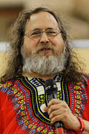

# The GNU Project

## What is GNU?
**GNU** stands for "GNU's Not Unix" - it's a recursive acronym. The GNU Project was launched in 1983 by Richard Stallman with the goal of creating a completely free Unix-like operating system.

## Key GNU Components:
- **GCC** (GNU Compiler Collection)
- **GNU Coreutils** (basic file, shell and text manipulation utilities)
- **GNU Bash** (Bourne Again SHell)
- **GNU Make** (build automation tool)
- **GNU Debugger (GDB)**

## The Four Freedoms of Free Software:
1. **Freedom 0**: The freedom to run the program for any purpose
2. **Freedom 1**: The freedom to study how the program works and change it
3. **Freedom 2**: The freedom to redistribute copies
4. **Freedom 3**: The freedom to distribute copies of your modified versions
---

## Navigation

**Next:** [→ Gnu General Public License](04-gnu-general-public-license.md)  
**Previous:** [← Operating System Vs Kernel](02-operating-system-vs-kernel.md)  
**Lesson Home:** [↑ Lesson 1: Introduction](../)  
**Course Home:** [⌂ Introduction to Linux](../README.md)
