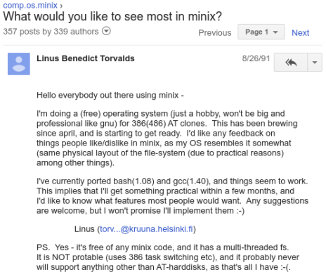

# MINIX: The Inspiration

## What is MINIX?
MINIX was created by Andrew Tanenbaum in 1987 as a Unix-like operating system designed for educational purposes.

## MINIX Characteristics:
- Microkernel design
- Written for teaching operating system concepts
- Came with complete source code
- Influenced Linus Torvalds when creating Linux

---

## Navigation

**Next:** [→ The Birth Of Linux](06-the-birth-of-linux.md)  
**Previous:** [← Gnu General Public License](04-gnu-general-public-license.md)  
**Lesson Home:** [↑ Lesson 1: Introduction](../)  
**Course Home:** [⌂ Introduction to Linux](../README.md)
