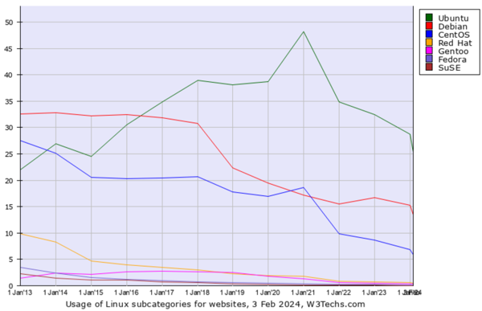
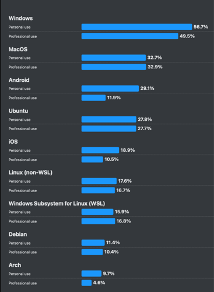
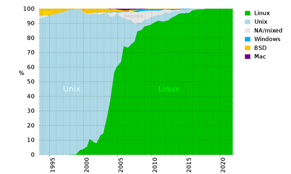

# Linux in the Real World

## Server Market Dominance

Linux dominates the server market, especially for:

- Web servers (Apache, Nginx)
- Database servers
- Cloud computing platforms
- Container orchestration (Docker, Kubernetes)

## Linux in IT

StackOVerflow Developer Survey 2025 Professional use of OS: 27,7% Ubuntu vs 32,9% MacOS vs 49,5 Windows:
https://survey.stackoverflow.co/2025/technology/

## Supercomputing

Linux runs on over 95% of the world's supercomputers, including:

- Scientific research systems
- Weather prediction systems
- Financial modeling systems

## Notable Companies Using Linux:

- **Google**: Entire infrastructure runs on Linux
- **Amazon**: AWS services built on Linux
- **Netflix**: Streaming infrastructure on Linux
- **SpaceX**: Mission-critical systems

## 

## Navigation

**Next:** [→ Why Learn Linux](09-why-learn-linux.md)  
**Previous:** [← Linux Distributions](07-linux-distributions.md)  
**Lesson Home:** [↑ Lesson 1: Introduction](../)  
**Course Home:** [⌂ Introduction to Linux](../README.md)
