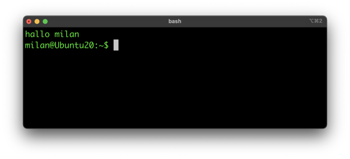

# 1. Understanding the Console: TTY Origins

---

## 📜 The TeleTYpe Writer (TTY)

<div align="center">


**Where it all began...**

</div>

> **TTY** = "TeleTYpe Writer" - early computer terminals that were essentially typewriters connected to computers.

This historical connection explains many Linux terminal concepts we use today! 🖥️⌨️

---

## 🔑 Key Terminology

### 🖥️ Terminal
> **Software that allows us to run a shell**

- Also called: *"pseudo-terminal"* or *"terminal emulator"*
- **Examples:** 
  - 🐧 GNOME Terminal, Konsole
  - 🍎 iTerm2, Terminal.app
  - 🪟 Windows Terminal

---

### 🎮 Console
> **A special type of terminal**

**Characteristics:**
- ❌ No graphical environment
- ⌨️ Direct interaction with keyboard and monitor
- 🔌 Can be accessed via serial cable
- 🖥️ Virtual consoles available in Linux
- 📟 Still called "tty" (TeleTYpe)

---

### 🐚 Shell
> **User interface software that receives commands from the terminal**

```
┌─────────┐      ┌─────────┐      ┌─────────┐
│ Terminal│ ───▶ │  Shell  │ ───▶ │ Kernel  │
└─────────┘      └─────────┘      └─────────┘
```

**Acts as interpreter between user and kernel**

**Available Shells:** bash, dash, zsh, ksh, sh

<div align="center">



</div>
---

## Navigation

**Next:** [→ The Shell Your Command Interface](02-the-shell-your-command-interface.md)  
**Previous:** [← Learning Objectives](00-learning-objectives.md)  
**Lesson Home:** [↑ Lesson 2: The Shell](../)  
**Course Home:** [⌂ Introduction to Linux](../README.md)
