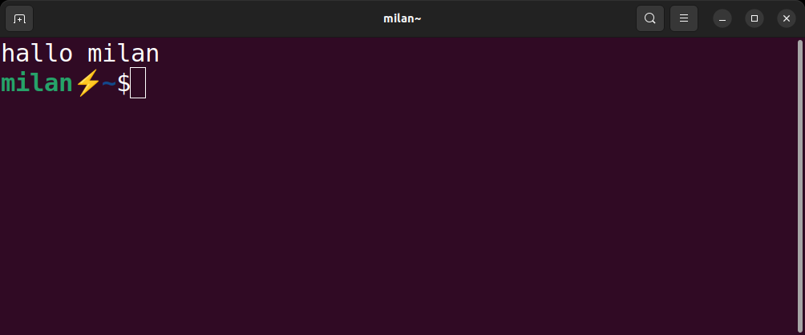

# 2. The Shell: Your Command Interface

### What Does the Shell Do?
- **Communication**: Interface with kernel, file system, and processes
- **Program Execution**: Starts and manages programs
- **Scripting**: Allows automation through scripts
- **Auto-completion**: Completes commands and file names (Tab key)
- **History**: Remembers and allows repetition of previous commands
- **Aliases**: Create shortcuts for complex commands

### Popular Shell Types:
- **bash** (Bourne Again SHell) - Most common on Linux
- **zsh** (Z Shell) - Feature-rich, default on macOS
- **dash** (Debian Almquist Shell) - Lightweight
- **ksh** (Korn Shell) - Unix heritage
- **sh** (Bourne Shell) - Original Unix shell

### Your First Terminal

When you start a terminal, you see a prompt that typically shows:
- Username
- Hostname (computer name)  
- Current directory
- Prompt character ($ for regular user, # for root)
---

## Navigation

**Next:** [→ User Types And Login](03-user-types-and-login.md)  
**Previous:** [← Understanding The Console Tty Origins](01-understanding-the-console-tty-origins.md)  
**Lesson Home:** [↑ Lesson 2: The Shell](../)  
**Course Home:** [⌂ Introduction to Linux](../README.md)
