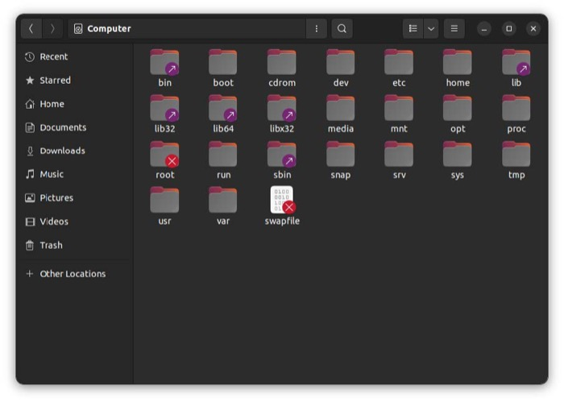

# 4. Linux File System Structure

---

## 🌳 File System Hierarchy Overview

```
                    / (Root Directory)
                    │
    ┌───────────────┼───────────────┐
    │               │               │
   bin             etc            home
  (commands)   (configuration)  (user dirs)
    │               │               │
    ├─ ls           ├─ passwd       ├─ alice/
    ├─ cat          ├─ hosts        ├─ bob/
    └─ grep         └─ fstab        └─ charlie/

   usr             var            tmp
 (programs)     (variable)   (temporary)
    │               │               │
    ├─ bin/         ├─ log/         └─ (temp files)
    ├─ lib/         ├─ mail/
    └─ share/       └─ spool/
```

---

## 🌍 The Root Directory (/)

<div align="center">



</div>

### 🪟 Windows vs 🐧 Linux

| Windows | Linux |
|---------|-------|
| Multiple roots: `C:\`, `D:\`, `E:\` | Single root: `/` |
| Drive letters | Everything under one tree |

> **Key Concept:** Linux has a **single root directory** `/` that contains everything!

---

## 📋 File System Hierarchy Standard (FHS)

<div align="center">


</div>

---

## 🗂️ Directory Tree Visualization

```
/                                    ← Root (everything starts here)
├── bin/                             ← Essential user commands
│   ├── ls, cat, grep, bash...
├── boot/                            ← Boot loader files
├── dev/                             ← Device files
│   ├── sda (disk), tty (terminal)...
├── etc/                             ← System configuration
│   ├── passwd, hosts, fstab...
├── home/                            ← User directories
│   ├── alice/
│   └── bob/
├── lib/                             ← Shared libraries
├── media/                           ← Removable media mount points
├── mnt/                             ← Temporary mount points
├── opt/                             ← Optional software
├── proc/                            ← Process information (virtual)
├── root/                            ← Root user's home
├── run/                             ← Runtime data
├── sbin/                            ← System administration commands
├── srv/                             ← Service data
├── sys/                             ← System information (virtual)
├── tmp/                             ← Temporary files
├── usr/                             ← User programs and data
│   ├── bin/                         ← User commands
│   ├── lib/                         ← User libraries
│   ├── local/                       ← Local software
│   └── share/                       ← Shared data
└── var/                             ← Variable data
    ├── log/                         ← Log files
    ├── mail/                        ← Mail files
    └── spool/                       ← Spool directories
```

---

## 🔑 Key Directories

### 🖥️ System Directories

| Directory | Purpose | Examples |
|-----------|---------|----------|
| **`/`** | 🌳 Root directory (top level) | Everything starts here |
| **`/bin`** | 🔧 Essential user binaries | `ls`, `cat`, `cp`, `mv` |
| **`/sbin`** | ⚙️ System binaries | `ifconfig`, `reboot`, `fdisk` |
| **`/usr/bin`** | 📦 User binaries | Installed programs |
| **`/usr/sbin`** | 🔐 User system binaries | Admin tools |
| **`/lib`** **`/lib64`** | 📚 Shared libraries | System libraries |
| **`/etc`** | ⚙️ Configuration files | System settings |
| **`/var`** | 📊 Variable data | Logs, databases |
| **`/tmp`** | 🗑️ Temporary files | Cleared on reboot |

### 👤 User Directories

| Directory | Purpose | Who Can Write |
|-----------|---------|---------------|
| **`/home`** | 🏠 User home directories | Individual users |
| **`/root`** | 👑 Root user's home | Root only |

### 🔌 Device and Virtual

| Directory | Purpose | Type |
|-----------|---------|------|
| **`/dev`** | 💾 Device files | Hardware access |
| **`/proc`** | 🔄 Process information | Virtual (kernel) |
| **`/sys`** | 🖥️ System information | Virtual (kernel) |

---

## 🧭 Path Examples

### 📍 Absolute Paths (start with `/`)

```
┌─────────────────────────────────────────┐
│ /home/alice/documents/report.txt        │
│ │    │     │         │                  │
│ │    │     │         └─ 📄 filename     │
│ │    │     └─ 📁 subdirectory           │
│ │    └─ 👤 user directory               │
│ └─ 🌳 always starts from root           │
└─────────────────────────────────────────┘
```

### 🎯 Relative Paths (no leading `/`)

```
┌─────────────────────────────────────────┐
│ documents/report.txt                    │
│ │         │                             │
│ │         └─ 📄 filename                │
│ └─ 📁 relative to current location      │
└─────────────────────────────────────────┘
```

### ✨ Special Path Symbols

| Symbol | Meaning | Example |
|--------|---------|---------|
| `~` | 🏠 Home directory | `/home/username` |
| `.` | 📍 Current directory | `./script.sh` |
| `..` | ⬆️ Parent directory | `../file.txt` |
| `/` | 🌳 Root directory | `/etc/hosts` |

---

## 📊 Directory Purpose Guide

| Category | Directories | Purpose | Icon |
|----------|-------------|---------|------|
| **Essential** | `/bin`, `/sbin` | Critical system commands | 🔧 |
| **Configuration** | `/etc` | System settings | ⚙️ |
| **User Data** | `/home`, `/root` | Personal files | 👤 |
| **Programs** | `/usr` | Installed software | 📦 |
| **Variable Data** | `/var` | Logs, mail, databases | 📊 |
| **Temporary** | `/tmp` | Temporary files | 🗑️ |
| **Devices** | `/dev` | Hardware access | 💾 |
| **Virtual** | `/proc`, `/sys` | Kernel information | 🔄 |
| **Mount Points** | `/media`, `/mnt` | External storage | 💿 |

---

## 💿 Program Files Location

<div align="center">


</div>

### 🪟 Windows vs 🐧 Linux Program Structure

| Component | Windows | Linux |
|-----------|---------|-------|
| **Executables** | `C:\Program Files\App\` | `/bin`, `/usr/bin` |
| **Libraries** | `C:\Program Files\App\` | `/lib`, `/usr/lib` |
| **Configuration** | `C:\Program Files\App\` | `/etc` |
| **Data Files** | `C:\Program Files\App\` | `/usr/share` |

> **Key Difference:** Windows keeps everything together; Linux distributes program components across the file system by type!

---

## Navigation

**Next:** [→ Home Directory Concepts](05-home-directory-concepts.md)  
**Previous:** [← User Types And Login](03-user-types-and-login.md)  
**Lesson Home:** [↑ Lesson 2: The Shell](../)  
**Course Home:** [⌂ Introduction to Linux](../README.md)
