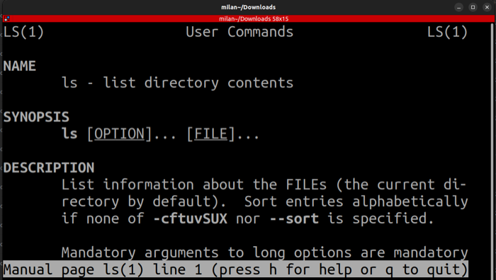

# 9. Getting Help with Commands

---

## 📚 The Manual System

### 🔍 Basic Help Commands

<table>
<tr>
<th width="40%">Command</th>
<th width="60%">Purpose</th>
</tr>
<tr>
<td><code>man &lt;command&gt;</code></td>
<td>📖 Full manual page for a command</td>
</tr>
<tr>
<td><code>man -k &lt;keyword&gt;</code></td>
<td>🔍 Search manual pages by keyword</td>
</tr>
<tr>
<td><code>apropos &lt;keyword&gt;</code></td>
<td>🔎 Same as <code>man -k</code></td>
</tr>
<tr>
<td><code>&lt;command&gt; --help</code></td>
<td>❓ Quick help summary</td>
</tr>
<tr>
<td><code>&lt;command&gt; -h</code></td>
<td>💡 Short help (some commands)</td>
</tr>
</table>

---

## 💻 Using man Pages

### Examples

```bash
# 📖 Get help for any command
man ls          # Learn about 'ls' command
man cp          # Learn about 'cp' command
man mv          # Learn about 'mv' command
man chmod       # Learn about 'chmod' command

# 🔍 Search manual pages
man -k copy     # Find all commands related to "copy"
apropos file    # Find all commands related to "file"

# ❓ Quick help
ls --help       # Quick reference for 'ls'
cp --help       # Quick reference for 'cp'
grep --help     # Quick reference for 'grep'
```

---

## 🖥️ Visual Examples

<div align="center">

### Opening a Manual Page



### Reading the ls Manual


</div>

---

## 🎮 Navigating man Pages

### Keyboard Shortcuts

| Key | Action | Icon |
|-----|--------|------|
| <kbd>Space</kbd> | ⬇️ Scroll down one page | |
| <kbd>b</kbd> | ⬆️ Scroll up one page | |
| <kbd>Enter</kbd> | ⬇️ Scroll down one line | |
| <kbd>↑</kbd> <kbd>↓</kbd> | ⬆️⬇️ Scroll line by line | |
| <kbd>/pattern</kbd> | 🔍 Search forward | Type `/` then search term |
| <kbd>n</kbd> | ⏭️ Next search result | |
| <kbd>N</kbd> | ⏮️ Previous search result | |
| <kbd>h</kbd> | ❓ Help within man | |
| <kbd>q</kbd> | 🚪 Quit | |

---

## 📋 man Page Structure

### Typical Sections

| Section | Description | Content |
|---------|-------------|---------|
| **NAME** | 🏷️ Command name | Brief description |
| **SYNOPSIS** | 📝 Usage syntax | How to use the command |
| **DESCRIPTION** | 📖 Full description | Detailed explanation |
| **OPTIONS** | ⚙️ Available options | All flags and parameters |
| **EXAMPLES** | 💡 Usage examples | Common use cases |
| **SEE ALSO** | 🔗 Related commands | Links to related topics |

---

## 🎯 Quick Help vs Full Manual

<table>
<tr>
<th width="50%">📄 <code>--help</code></th>
<th width="50%">📚 <code>man</code></th>
</tr>
<tr>
<td valign="top">

**Best for:**
- ✅ Quick reference
- ✅ Syntax reminder
- ✅ List of options
- ✅ Fast lookup

**Example:**
```bash
ls --help
# Shows: brief summary
```

</td>
<td valign="top">

**Best for:**
- 📖 Detailed documentation
- 📖 Complete explanation
- 📖 Usage examples
- 📖 Deep understanding

**Example:**
```bash
man ls
# Shows: full manual
```

</td>
</tr>
</table>

---

## 💡 Pro Tips

```bash
# 🎯 Tip 1: Find command by description
apropos "list directory"

# 🎯 Tip 2: Search within man page
# Press '/' then type search term, press Enter

# 🎯 Tip 3: Save man page as text file
man ls > ls-manual.txt

# 🎯 Tip 4: Get specific section
man 5 passwd    # Section 5 of passwd (file format)
man 1 passwd    # Section 1 of passwd (command)
```
---

## Navigation

**Next:** [→ Practical Exercises](10-practical-exercises.md)  
**Previous:** [← Essential File Commands](08-essential-file-commands.md)  
**Lesson Home:** [↑ Lesson 2: The Shell](../)  
**Course Home:** [⌂ Introduction to Linux](../README.md)
