# 2. Environment Variables


### What Are Environment Variables?
Environment variables are dynamic values that affect how processes run on your system. They store information about your system environment.

### Viewing Environment Variables:

```bash
# Show all environment variables
env

# Show all variables (including shell variables)
set

# Show specific variable
echo $VARIABLE_NAME
echo $HOME
echo $USER
echo $PATH
```

### Important Environment Variables:

#### $HOME
- Your home directory path
- Example: `/home/username`

```bash
echo $HOME
cd $HOME    # Same as: cd ~
```

#### $USER
- Your username

```bash
echo $USER
whoami      # Same information
```

#### $PWD
- Present Working Directory (current directory)

```bash
echo $PWD
pwd         # Same information
```

#### $PATH
- Directories where shell looks for commands
- Colon-separated list of directories

```bash
echo $PATH
# Example output: /usr/local/bin:/usr/bin:/bin:/usr/games
```

#### $PS1
- Primary shell prompt appearance

```bash
echo $PS1
# Example: \u@\h:\w\$
# \u = username, \h = hostname, \w = working directory
```

#### $SHELL
- Path to your current shell

```bash
echo $SHELL
# Example: /bin/bash
```

### Creating Variables:

```bash
# Create a variable (no spaces around =)
MY_VARIABLE="Hello World"
NAME="Linux Student"
NUMBER=42

# Use the variable
echo $MY_VARIABLE
echo "My name is $NAME"
echo "The answer is $NUMBER"
```

### Exporting Variables:
Variables created in shell are local by default. To make them available to child processes:

```bash
# Create and export in one step
export MY_GLOBAL_VAR="Available everywhere"

# Or create then export
MY_VAR="test"
export MY_VAR

# Check if variable is exported
env | grep MY_VAR
```

---

## Why Are Environment Variables Important?

Environment variables are **critical for security and flexibility** in modern applications. They allow you to separate configuration from code, making applications portable and secure across different environments (development, testing, production).

### 🚫 The Wrong Way: Hardcoding Credentials

Imagine a backend application that needs to connect to a database:

```mermaid
graph TD
    A["<b>Backend Application</b><br/>(app.js - committed to GitHub)<br/><br/>const connectionString =<br/>'mongodb://admin:password123@<br/>db.company.com:27017/production'"]
    B["<b>Production Database 🗄️</b><br/>(Credentials exposed in code!)"]
    
    A -->|"❌ Hardcoded Connection"| B
    
    style A fill:#ffcccc,stroke:#cc0000,stroke-width:3px
    style B fill:#ffcccc,stroke:#cc0000,stroke-width:2px
    
    classDef problemBox fill:#ffcccc,stroke:#cc0000,stroke-width:2px
```



**❌ PROBLEMS:**
- Password visible in code
- Can't change per environment
- Security risk if code is leaked
- Everyone with code access sees secrets

### ✅ The Right Way: Using Environment Variables

#### Development Environment Flow

```mermaid
graph TD
    A["<b>Development Environment 💻</b><br/><br/>export DB_CONNECTION_STRING=<br/>'mongodb://localhost:27017/dev'<br/>export DB_USER='dev_user'<br/>export DB_PASSWORD='dev_pass'"]
    B["<b>Backend Application</b><br/>(app.js - safe to share publicly)<br/><br/>const connectionString =<br/>process.env.DB_CONNECTION_STRING<br/>const dbUser = process.env.DB_USER<br/>const dbPass = process.env.DB_PASSWORD"]
    C["<b>Development Database 🗄️</b><br/>(localhost:27017)"]
    
    A -->|"Environment Variables"| B
    B -->|"✅ Secure Connection"| C
    
    style A fill:#d4edda,stroke:#28a745,stroke-width:3px
    style B fill:#d4edda,stroke:#28a745,stroke-width:3px
    style C fill:#d4edda,stroke:#28a745,stroke-width:2px
```



#### Production Environment Flow

```mermaid
graph TD
    A["<b>Production Environment ☁️</b><br/><br/>export DB_CONNECTION_STRING=<br/>'mongodb://prod.db.aws:27017/prod'<br/>export DB_USER='prod_user'<br/>export DB_PASSWORD='$3cur3P@ss!'"]
    B["<b>Same Backend Application</b><br/>(Uses environment variables)<br/><br/>→ Automatically connects to<br/>the right database!"]
    C["<b>Production Database 🗄️</b><br/>(Secure AWS Database)"]
    
    A -->|"Environment Variables"| B
    B -->|"✅ Secure Connection"| C
    
    style A fill:#cce5ff,stroke:#007bff,stroke-width:3px
    style B fill:#cce5ff,stroke:#007bff,stroke-width:3px
    style C fill:#cce5ff,stroke:#007bff,stroke-width:2px
```



**✅ BENEFITS:**
- No secrets in code
- Different config per environment
- Secure and flexible
- Same codebase works everywhere

### Real-World Example

In a typical backend application:

```bash
# Set environment variables before running your app
export DB_HOST="localhost"
export DB_PORT="5432"
export DB_NAME="myapp"
export DB_USER="developer"
export DB_PASSWORD="dev_password"
export API_KEY="your_api_key_here"
export NODE_ENV="development"

# Now run your application
node app.js
```

Your application code can safely use these:

```javascript
// No hardcoded secrets! ✅
const dbConfig = {
  host: process.env.DB_HOST,
  port: process.env.DB_PORT,
  database: process.env.DB_NAME,
  user: process.env.DB_USER,
  password: process.env.DB_PASSWORD
};
```

### 🎯 Key Takeaways

| Aspect | Hardcoded Values | Environment Variables |
|--------|------------------|----------------------|
| **Security** | 🔴 Exposed in code | 🟢 Hidden from code |
| **Flexibility** | 🔴 Must edit code to change | 🟢 Change without code edits |
| **Portability** | 🔴 Different code per environment | 🟢 Same code everywhere |
| **Team Sharing** | 🔴 Everyone sees secrets | 🟢 Each team member has own config |
| **Version Control** | 🔴 Secrets in Git history | 🟢 Safe to commit code |

> **💡 Pro Tip:** In production, environment variables are often stored in secure secret management systems like AWS Secrets Manager, Azure Key Vault, or HashiCorp Vault, adding an extra layer of security!

---

## Navigation

**Next:** [→ Command History](03-command-history.md)  
**Previous:** [← Review Shell Basics Lesson 12 Recap](01-review-shell-basics-lesson-12-recap.md)  
**Lesson Home:** [↑ Lesson 3: History & Variables](../)
**Course Home:** [⌂ Introduction to Linux](../README.md)
