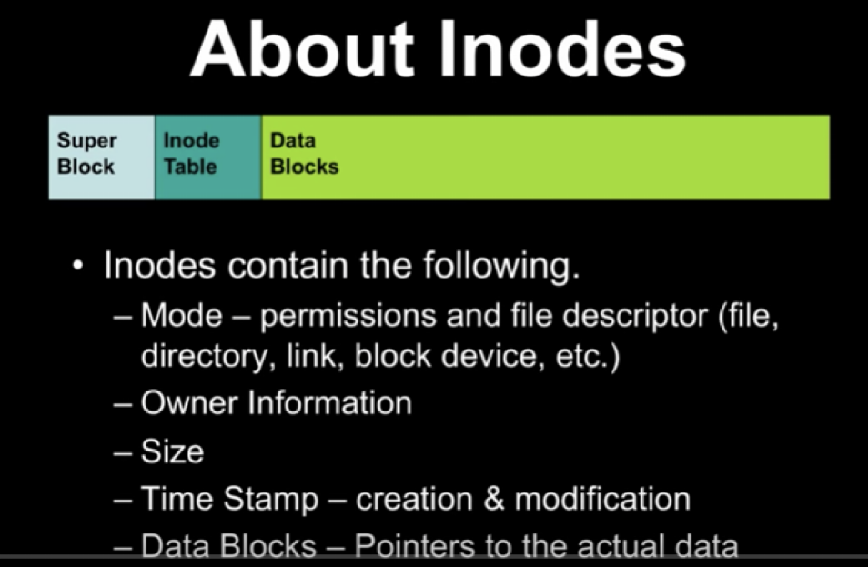

# 5. Understanding Inodes



### What is an Inode?

An inode (index node) is a data structure that stores metadata about a file or directory.

### Inode Structure Diagram:

```
┌─────────────────────────────────────────┐
│           INODE #12345                  │
├─────────────────────────────────────────┤
│  Metadata:                              │
│  ┌────────────────────────────────────┐ │
│  │ File Type:        Regular File     │ │
│  │ Permissions:      -rw-r--r--       │ │
│  │ Owner (UID):      1000             │ │
│  │ Group (GID):      1000             │ │
│  │ File Size:        4096 bytes       │ │
│  │ Link Count:       2                │ │
│  │ Last Access:      2026-03-15 10:30 │ │
│  │ Last Modified:    2026-03-14 14:20 │ │
│  │ Last Changed:     2026-03-14 14:20 │ │
│  └────────────────────────────────────┘ │
│                                         │
│  Data Block Pointers:                   │
│  ┌────────────────────────────────────┐ │
│  │ Direct Blocks (12):                │ │
│  │  [0] → Block 5001                  │ │
│  │  [1] → Block 5002                  │ │
│  │  [2] → Block 5003                  │ │
│  │  [3] → Block 5004                  │ │
│  │  [4-11] → (unused)                 │ │
│  │                                    │ │
│  │ Indirect Block:    → Block 6000    │ │
│  │ Double Indirect:   → Block 7000    │ │
│  │ Triple Indirect:   → Block 8000    │ │
│  └────────────────────────────────────┘ │
└─────────────────────────────────────────┘
```

### Directory Entries and Inodes:

```
Directory: /home/user/documents/
┌──────────────────────────────────────────┐
│  Directory File (Inode #2048)          │
├──────────────────────────────────────────┤
│  Filename        →  Inode Number         │
├──────────────────────────────────────────┤
│  .              →  2048 (self)           │
│  ..             →  1024 (parent)         │
│  report.txt     →  12345                 │
│  notes.txt      →  12346                 │
│  backup.txt     →  12345  (hard link!)   │
│  link.txt       →  12347  (symlink)      │
└──────────────────────────────────────────┘
         ↓               ↓
    [Inode 12345]   [Inode 12346]
    Link Count: 2   Link Count: 1
    (report.txt     (notes.txt)
     & backup.txt)
```

### How Files Are Accessed:

```
1. User requests: cat /home/user/file.txt

2. Filesystem lookup:
   ┌──────┐      ┌──────┐      ┌──────┐      ┌──────┐
   │  /   │ ──→  │ home │ ──→  │ user │ ──→  │file  │
   │Root  │      │Dir   │      │Dir   │      │.txt  │
   │Inode │      │Inode │      │Inode │      │Inode │
   │  2   │      │ 100  │      │ 1024 │      │12345 │
   └──────┘      └──────┘      └──────┘      └──────┘
                                                  ↓
                                          ┌──────────────┐
                                          │ Data Blocks: │
                                          │ 5001, 5002   │
                                          │ 5003, 5004   │
                                          └──────────────┘

3. Read data from blocks pointed to by inode 12345
```

### Inode vs. Filename:

```
┌─────────────────────────────────────────────────┐
│  Key Concept: The filename is NOT in the inode! │
├─────────────────────────────────────────────────┤
│                                                 │
│  Filename (in directory) ──→ Inode Number       │
│  Inode Number ──→ File Metadata + Data Blocks   │
│                                                 │
│  This allows:                                   │
│  • Multiple names (hard links) → Same inode     │
│  • Rename without copying data                  │
│  • Same file accessible from multiple paths     │
└─────────────────────────────────────────────────┘
```

### Inode Information:

- File type and permissions
- Owner and group
- File size
- Timestamps (access, modify, change)
- Link count
- Block locations on disk

### Working with Inodes:

```bash
# Show inode numbers
ls -i file.txt
ls -li directory/

# Detailed inode information
stat file.txt

# Find files by inode
find . -inum 123456

# Show inode usage
df -i                            # Inode usage per filesystem

# ℹ️ Check file system inode limits
tune2fs -l /dev/sda1 | grep -i inode
```

### Practical Inode Concepts:

```bash
# Hard links share inodes
echo "test content" > original.txt
ln original.txt hardlink.txt
ls -li original.txt hardlink.txt    # Same inode number

# Soft links have different inodes
ln -s original.txt softlink.txt
ls -li original.txt softlink.txt    # Different inode numbers

# Monitor link counts
stat original.txt                   # Shows link count
rm hardlink.txt
stat original.txt                   # Link count decreased
```

---

## Navigation

**Next:** [→ Practical Labs](06-practical-labs.md)  
**Previous:** [← Understanding Links](04-understanding-links.md)  
**Lesson Home:** [↑ Lesson 6: Globbing & Archiving](../)
**Course Home:** [⌂ Introduction to Linux](../README.md)
