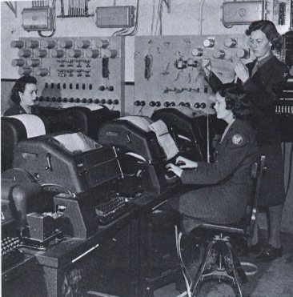

# 1. Understanding the Console: TTY Origins

### The TeleTYpe Writer

The term "TTY" comes from "TeleTYpe Writer" - early computer terminals that were essentially typewriters connected to computers. This historical connection explains many Linux terminal concepts we use today.

### Key Terminology

#### Terminal
- **Definition**: Software that allows us to run a shell
- Also called "pseudo-terminal" or "terminal emulator"
- Examples: GNOME Terminal, Konsole, iTerm2, Windows Terminal

#### Console
- **Definition**: A special type of terminal
- Characteristics:
  - No graphical environment
  - Direct interaction with keyboard and monitor
  - Can be accessed via serial cable
  - Virtual consoles available in Linux
  - Still called "tty" (TeleTYpe)

#### Shell
- **Definition**: User interface software that receives commands from the terminal
- Acts as interpreter between user and kernel
- Different shells available: bash, dash, zsh, ksh, sh

---

## Navigation

**Previous:** [← Learning Objectives](00-learning-objectives.md)  
**Next:** [→ The Shell Your Command Interface](02-the-shell-your-command-interface.md)  
**Lesson Home:** [↑ Lesson 02: Shell](../)  
**Course Home:** [⌂ Introduction to Linux](../README.md)
