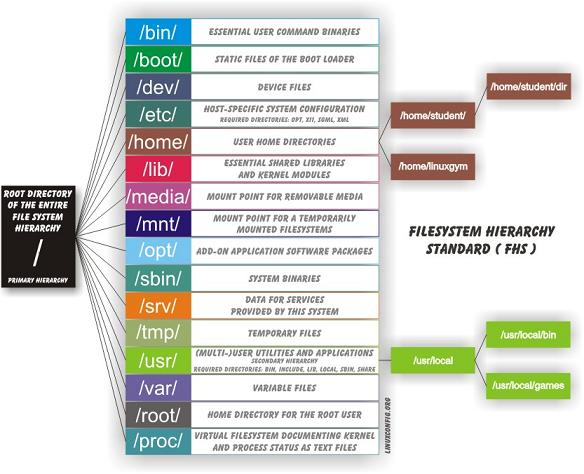

# 4. Linux File System Structure

## File System Hierarchy Overview

```
                    / (Root Directory)
                    │
    ┌───────────────┼───────────────┐
    │               │               │
   bin             etc            home
  (commands)   (configuration)  (user dirs)
    │               │               │
    ├─ ls          ├─ passwd       ├─ alice/
    ├─ cat         ├─ hosts        ├─ bob/
    └─ grep        └─ fstab        └─ charlie/
    
   usr             var            tmp
 (programs)     (variable)   (temporary)
    │               │               │
    ├─ bin/        ├─ log/         └─ (temp files)
    ├─ lib/        ├─ mail/
    └─ share/      └─ spool/
```

### The Root Directory (/)


Unlike Windows with drive letters (C:, D:), Linux has a single root directory `/` that contains everything.

### File System Hierarchy Standard (FHS)


## Directory Tree Visualization

```
/                                    ← Root (everything starts here)
├── bin/                             ← Essential user commands
│   ├── ls, cat, grep, bash...
├── boot/                            ← Boot loader files  
├── dev/                             ← Device files
│   ├── sda (disk), tty (terminal)...
├── etc/                             ← System configuration
│   ├── passwd, hosts, fstab...
├── home/                            ← User directories
│   ├── alice/
│   └── bob/
├── lib/                             ← Shared libraries
├── media/                           ← Removable media mount points
├── mnt/                             ← Temporary mount points
├── opt/                             ← Optional software
├── proc/                            ← Process information (virtual)
├── root/                            ← Root user's home
├── run/                             ← Runtime data
├── sbin/                            ← System administration commands
├── srv/                             ← Service data
├── sys/                             ← System information (virtual)
├── tmp/                             ← Temporary files
├── usr/                             ← User programs and data
│   ├── bin/                         ← User commands
│   ├── lib/                         ← User libraries
│   ├── local/                       ← Local software
│   └── share/                       ← Shared data
└── var/                             ← Variable data
    ├── log/                         ← Log files
    ├── mail/                        ← Mail files
    └── spool/                       ← Spool directories
```

### Key Directories:

#### System Directories:
- **`/`** - Root directory (top level)
- **`/bin`** - Essential user binaries (commands)
- **`/sbin`** - System binaries (admin commands)
- **`/usr/bin`** - User binaries
- **`/usr/sbin`** - User system binaries
- **`/lib`**, **`/lib32`**, **`/lib64`** - Shared libraries
- **`/etc`** - Configuration files
- **`/var`** - Variable data (logs, temporary files)
- **`/tmp`** - Temporary files

#### User Directories:
- **`/home`** - User home directories
- **`/root`** - Root user's home directory

#### Device and Virtual:
- **`/dev`** - Device files

## Path Examples

```
Absolute Paths (start with /):
┌─────────────────────────────────────────┐
│ /home/alice/documents/report.txt       │
│ │    │     │         │                 │
│ │    │     │         └─ filename       │
│ │    │     └─ subdirectory             │
│ │    └─ user directory                 │
│ └─ always starts from root             │
└─────────────────────────────────────────┘

Relative Paths (no leading /):
┌─────────────────────────────────────────┐
│ documents/report.txt                    │
│ │         │                            │
│ │         └─ filename                   │
│ └─ relative to current location        │
└─────────────────────────────────────────┘

Special Path Symbols:
~     = home directory     (/home/username)
.     = current directory
..    = parent directory
/     = root directory
```

## Directory Purpose Guide

```
Category        │ Directories      │ Purpose
────────────────┼──────────────────┼───────────────────────
Essential       │ /bin, /sbin      │ Critical system commands
Configuration   │ /etc             │ System settings
User Data       │ /home, /root     │ Personal files
Programs        │ /usr             │ Installed software
Variable Data   │ /var             │ Logs, mail, databases
Temporary       │ /tmp             │ Temporary files
Devices         │ /dev             │ Hardware access
Virtual         │ /proc, /sys      │ Kernel information
Mount Points    │ /media, /mnt     │ External storage
```
- **`/proc`** - Process information
- **`/sys`** - System information

### Program Files Location


Unlike Windows' "Program Files" directory, Linux programs are distributed across:
- **`/bin`** and **`/usr/bin`** - Executable files
- **`/lib`** and **`/usr/lib`** - Libraries
- **`/etc`** - Configuration files
- **`/usr/share`** - Shared data files
---

## Navigation

**Previous:** [← User Types And Login](03-user-types-and-login.md)
**Next:** [→ File System Navigation Quiz](05-file-system-navigation-quiz.md)  
**Lesson Home:** [↑ Lesson 02: Shell](../)  
**Course Home:** [⌂ Introduction to Linux](../README.md)
