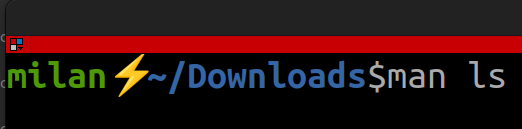

# 9. Getting Help with Commands


### The Manual System:
```bash
# Get help for any command
man command_name
man ls
man cp
man mv

# Search manual pages
man -k keyword
apropos keyword

# Quick help
command_name --help
ls --help
cp --help
```



---

## Navigation

**Previous:** [← Essential File Commands](10-essential-file-commands.md)  
**Next:** [→ Practical Exercises](12-practical-exercises.md)  
**Lesson Home:** [↑ Lesson 02: Shell](../)  
**Course Home:** [⌂ Introduction to Linux](../README.md)
