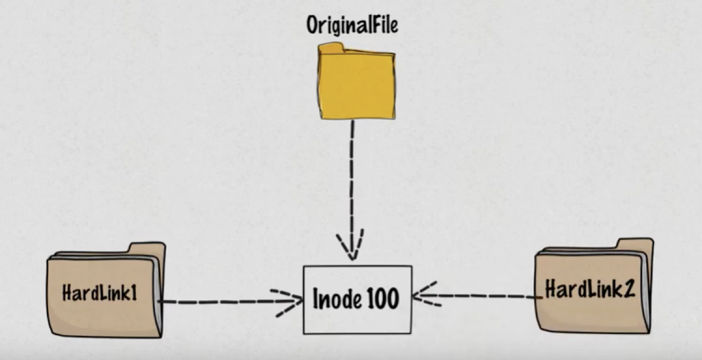

# 4. Understanding Links

## Link Types Overview

```
┌─────────────────────────────────────────────────────────────┐
│                       File System                           │
│                                                             │
│  ┌─────────────┐    ┌─────────────┐    ┌─────────────┐      │
│  │   Inode     │    │    Hard     │    │    Soft     │      │
│  │   (Data)    │◀───│    Link     │    │    Link     │      │
│  │             │    │             │    │      │      │      │
│  │ File Data   │    │  Same       │    │   Points    │      │
│  │ Metadata    │◀───│  Inode      │    │      │      │      │
│  │ Permissions │    │             │    │      ▼      │      │
│  └─────────────┘    └─────────────┘    └──────┼──────┘      │
│         ▲                                     │             │
│         │                                     │             │
│  ┌─────────────┐                              │             │
│  │  Original   │                              │             │
│  │   Filename  │                              │             │
│  └─────────────┘                              │             │
│                                               ▼             │
│                                    ┌─────────────┐          │
│                                    │  Target     │          │
│                                    │  Path       │          │
│                                    └─────────────┘          │
└─────────────────────────────────────────────────────────────┘
```




### Hard Links vs Soft Links

```
Hard Links:                          Soft Links:
┌─────────────┐                     ┌─────────────┐
│ original.txt│─────┐               │ original.txt│
└─────────────┘     │               └─────────────┘
                    ▼                       ▲
             ┌─────────────┐                │
             │   Inode     │                │
             │   12345     │                │
             │             │                │
             │ File Data:  │                │
             │ "Hello..."  │                │
             └─────────────┘                │
                    ▲                       │
┌─────────────┐     │               ┌─────────────┐
│hardlink.txt │─────┘               │softlink.txt │
└─────────────┘                     │     │       │
                                    │  ─────────  │
Same inode = Same file              │ "original.  │
Delete original: hardlink works     │  txt"       │
                                    └─────────────┘
                                    
                                    Different inode
                                    Delete original: link breaks
```

#### Hard Links:
- Multiple names for the same file
- Share the same inode number
- Cannot link directories
- Cannot cross file system boundaries
- File data survives if original is deleted

#### Soft Links (Symbolic Links):
- Pointer to another file or directory
- Has its own inode
- Can link directories
- Can cross file system boundaries
- Broken if original is deleted

### Creating Links:

```bash
# Create hard link
ln original.txt hardlink.txt

# Create soft link
ln -s original.txt softlink.txt
ln -s /path/to/directory linkname

# Create soft link with relative path
ln -s ../config/app.conf current_config

# Create multiple hard links
ln original.txt link1.txt link2.txt
```

## Link Behavior Examples

```
Initial State:
┌──────────────┐    inode: 123456
│original.txt  │◀─── "Hello World"
└──────────────┘    

After creating links:
┌──────────────┐    ┌──────────────┐    inode: 123456
│original.txt  │◀───│hardlink.txt  │◀─── "Hello World"
└──────────────┘    └──────────────┘    

┌──────────────┐    inode: 789012
│softlink.txt  │ ─── "original.txt" ──┐
└──────────────┘                      │
                                      ▼
                           ┌──────────────┐
                           │original.txt  │
                           └──────────────┘

Link Count Check:
$ ls -l
-rw-r--r-- 2 user group 11 Oct 15 10:30 original.txt
-rw-r--r-- 2 user group 11 Oct 15 10:30 hardlink.txt
lrwxrwxrwx 1 user group 11 Oct 15 10:31 softlink.txt -> original.txt
           ^                                            ^
    Hard link count                              Link indicator
```

### Working with Links:

```bash
# Check link information
ls -li file*                     # Shows inode numbers
stat original.txt                # Detailed file information
file linkname                    # Shows link type

# Find all hard links to a file
find . -inum $(stat -c %i original.txt)

# Remove links
rm hardlink.txt                  # Removes link, file survives if other links exist
rm softlink.txt                  # Removes link only
unlink linkname                  # Alternative removal method
```

### Practical Link Examples:

```bash
# Configuration management
ln -s /etc/nginx/sites-available/mysite /etc/nginx/sites-enabled/

# Version management
ln -s /opt/java/jdk-11 /opt/java/current

# Backup strategy
ln important.txt backup_hardlink.txt    # Hard link backup

# Cross-directory access
ln -s ~/Documents/Projects ~/Desktop/Projects

# Temporary links
ln -s /var/log/application.log ~/current.log
```
---

## Navigation

**Previous:** [← Archiving And Compression](03-archiving-and-compression.md)  
**Next:** [→ Understanding Inodes](05-understanding-inodes.md)  
**Lesson Home:** [↑ Lesson 06: Globbing Archiving Links](../)  
**Course Home:** [⌂ Introduction to Linux](../README.md)
